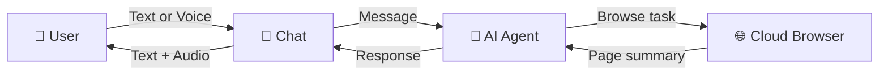

# README Refactor Implementation Plan

> **For Claude:** REQUIRED SUB-SKILL: Use superpowers:executing-plans to implement this plan task-by-task.

**Goal:** Rewrite README.md with accurate features, a "How It Works" Mermaid diagram, corrected tech stack, and corrected getting started instructions.

**Architecture:** Single-file rewrite of `README.md`. Keep Problem and Solution sections verbatim. Replace everything else.

**Tech Stack:** Markdown, Mermaid diagrams (GitHub-native rendering)

---

### Task 1: Rewrite README.md

**Files:**
- Modify: `README.md`

**Step 1: Replace the full contents of `README.md`**

Write the following to `README.md` (Problem and Solution paragraphs kept verbatim from original):

````markdown
# Simple Surf

An AI-powered conversational web browser designed to make the internet accessible and easy to navigate for elderly users through voice or text interactions.

## The Problem

As of 2025, there are over 1.1 billion people aged 60 or older worldwide, a number that is projected to grow to 1.4 billion by 2030 and 2.1 billion by 2050 according to the United Nations. While the internet has become essential for everyday activities such as health management, banking, government services, and communication, older adults consistently report significant barriers to online engagement. Studies show that up to 40% of seniors have difficulty completing basic web tasks due to small interfaces, unpredictable navigation patterns, complex forms, and overwhelming visual design. For many, this leads to frustration, decreased digital independence, and reliance on family members or caregivers for simple tasks like renewing prescriptions, scheduling appointments, or accessing benefits online.

## The Solution

Simple Surf addresses this challenge by transforming the web into a conversational experience, allowing elderly users to interact through voice or text with an AI agent that browses and acts on their behalf. By abstracting away confusing layouts and offering guided, senior-friendly interactions, Simple Surf empowers older adults to confidently use essential digital services, improving autonomy, dignity, and quality of life for a rapidly growing global population.

## Features

- **Conversational Browsing** — Chat with an AI agent that navigates websites and performs tasks on your behalf
- **Voice Chat** — Hold-to-talk microphone with speech-to-text input and automatic text-to-speech on AI responses
- **Smart Screen Summaries** — The AI summarizes web pages and asks clarifying questions to guide you step by step
- **Web Search** — Find information through natural conversation without navigating complex search engines
- **Senior-Friendly Design** — Large, clear interface with minimal cognitive load, built for accessibility

## How It Works



The user sends a message through the chat interface using text or voice. The AI agent decides whether to search the web, browse to a website, or respond directly. When browsing is needed, the agent controls a cloud browser session, reads and summarizes the page, and asks follow-up questions to guide the user. Responses are delivered as text, and automatically read aloud when the user sent their message via voice.

## Tech Stack

- [Next.js 15](https://nextjs.org) + React 19 — App framework
- [Vercel AI SDK](https://sdk.vercel.ai) + AI Gateway — LLM orchestration
- [BrowserUse SDK](https://browseruse.com) — Cloud browser automation
- [ElevenLabs](https://elevenlabs.io) — Speech-to-text and text-to-speech
- [better-auth](https://www.better-auth.com) — Authentication (Google OAuth)
- [Prisma](https://prisma.io) + PostgreSQL — Database
- [Upstash Redis](https://upstash.com) — Session state
- [Tailwind CSS](https://tailwindcss.com) + [shadcn/ui](https://ui.shadcn.com) — Styling
- [tRPC](https://trpc.io) — Type-safe API

## Getting Started

### Prerequisites

- Node.js 18+
- [pnpm](https://pnpm.io)
- PostgreSQL database

### Installation

1. Clone the repository

```bash
git clone https://github.com/sarahsimionescu/simple-surf.git
cd simple-surf
```

2. Install dependencies

```bash
pnpm install
```

3. Set up environment variables

```bash
cp .env.example .env
```

4. Fill in the `.env` file with your credentials (see `.env.example` for required variables)

5. Push the database schema

```bash
pnpm db:push
```

6. Start the development server

```bash
pnpm dev:local
```

7. Open [http://localhost:3000](http://localhost:3000) in your browser
````

**Step 2: Verify the Mermaid diagram renders**

Open the README on GitHub (or use a local Mermaid preview) and confirm the flowchart renders correctly with the user→chat→AI→browser loop.

**Step 3: Commit**

```bash
git add README.md
git commit -m "docs: refactor README with accurate features, how-it-works diagram, and corrected setup instructions"
```
